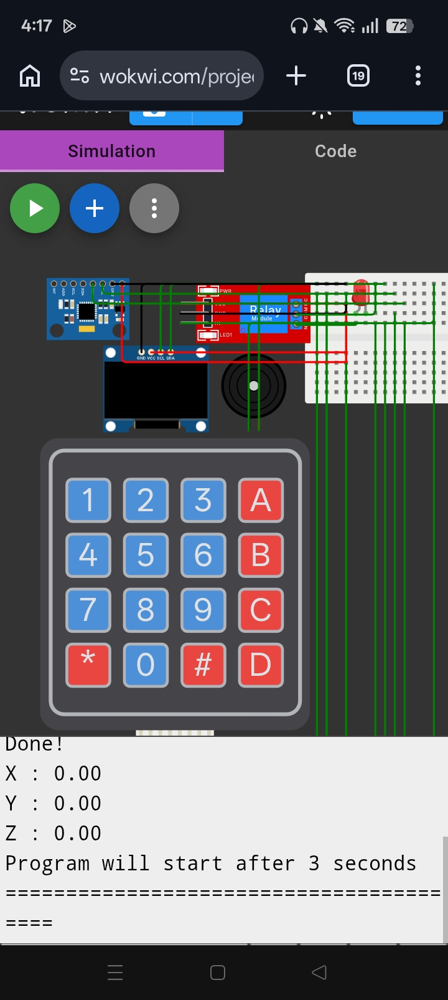

# Roll-the-dice-Simulator-using-Arduino-Uno-

## Wiring (see diagram above)

| Component | Arduino pin(s) | Notes |
|---|---|---|
| OLED SSD1306 | SDA→A4, SCL→A5, VCC→5V, GND→GND | Shared I2C bus |
| MPU6050 | SDA→A4, SCL→A5, VCC→3.3-5V, GND→GND | Same I2C bus, different address, no conflict |
| Buzzer | D3 | 
| 4x4 keypad | Rows→D4,D5,D6,D7 / Cols→D8,D9,D10,D2 | Needs the `Keypad` library (Library Manager → search "Keypad" by Mark Stanley) |
| L298N driver IN1/IN2 | D12 / D13 | Direction control |
| L298N driver ENA | D11 (PWM) | Speed control via `analogWrite` |
| L298N OUT1/OUT2 | → TT gear motor's two wires | Polarity only matters for spin direction |
| L298N +12V/VM | External 4–9V supply (e.g. 4×AA pack), **not** the Arduino 5V pin | The TT motor draws more current than the Uno can safely source |
| L298N GND | Shared with Arduino GND | Critical — common ground or the motor logic won't work |
|RELAY MODULE | VCC -> 5v, GND -> GND, IN -> A0, NO -> positive of load, COM -> external battery source's positive|
|QBM High Voltage Generator DC 6-12V to 400kV| negative -> negative of the external battery, positive -> NO of relay module|
|6 AA NIMH RECHARGEABLE BATTERY WITH BATTERY HOLDER|
|JUMPER WIRES FEMALE & MALE|


**1. Enter number first**
Screen shows "Enter number 1-6 / Press # to confirm." You press a digit key (1-6), it shows on screen, then you press `#` to lock it in. If you typed something outside 1-6, it flashes "Invalid!" and makes you re-enter — you can't move on until a valid number is confirmed.

**2. Then it asks you to roll (shake) the dice**
Screen switches to "Roll the dice!" and just waits. Nothing else happens until the motion sensor detects a shake (acceleration magnitude > 1.5).

**3. Shuffling starts**
The moment a shake is detected, it runs the 10-frame shuffle animation — random dots flashing rapidly inside the dice box, with a buzzer tick on each frame — exactly like your original code's shuffle effect.

**4. Shuffle stops on a final number, then it's matched**
After the 10 shuffle frames, it picks one random result (1-6), draws the correct dot pattern for that number, plays the 3-beep result tone, and *then* compares that result against the number you entered back in step 1.

**5a. If matched → win**
Screen shows "Congratulations / You Win!" and the motor spins for 3 seconds (your reward), then the game loops back to step 1 for a new round.

**5b. If not matched → lose**
Screen shows:
```
You Lose!
daddy will punish you!

Press # to restart
```
The motor does **not** run. It then just sits there — not accepting any key except `#`. Pressing any other key (letters, `*`, other digits) does nothing. Only pressing `#` sends it back to step 1 to start a brand new round.


